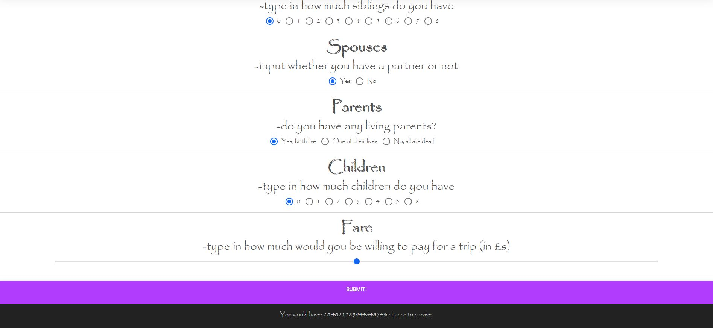

## Hello

https://michalina-czechowska.pl/

This site is my test bed where I am going to experiment with different technologies and try to implement some cool features. 
It is not finished yet (and probably never will be fully finished). 

Backend is made with django framework, and frontend is made with html and css. I also used Bootstrap toolkit.
Website is containerized with Docker. Next step is to rewrite frontend JS with TypeScript and add CI/CD

In the future I plan to add all my machine learning models as REST API, so that anyone can try it.

## 8 march

Add Titanic API and a form, where the user can input some data and see the chance to survive if he was on Titanic.

